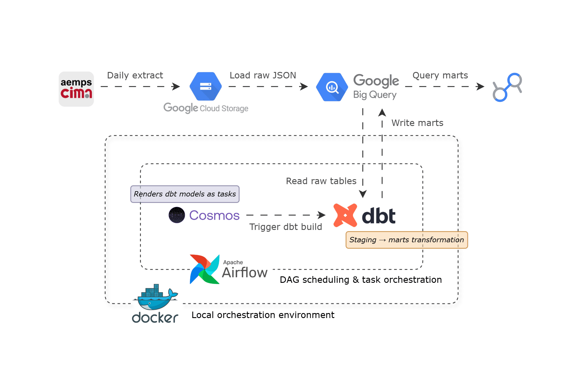
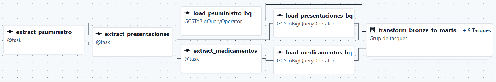
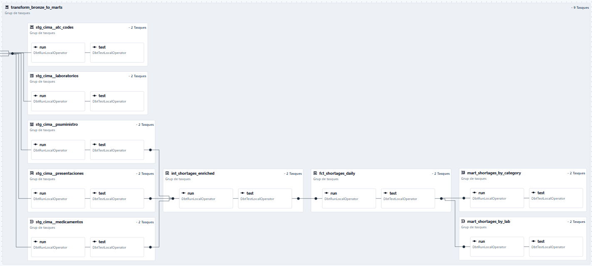
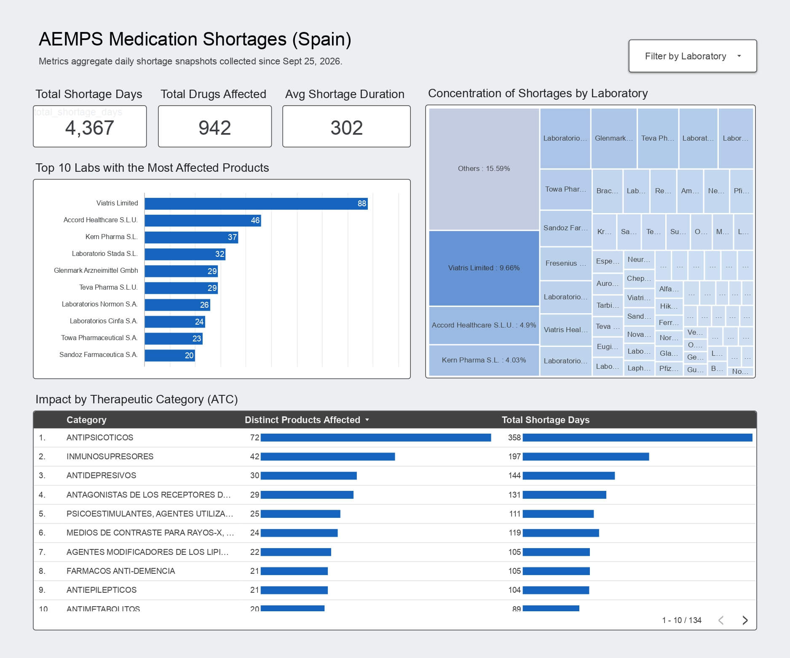

# Suministro

An automated data pipeline that tracks daily medication shortages in Spain. It
pulls data from the Spanish Agency of Medicines ([CIMA API](https://cima.aemps.es/cima/resources/docs/CIMA_REST_API.pdf)), saves it to Google Cloud Storage, loads it into Google
BigQuery, and transforms it into ready-to-use tables using dbt and Apache Airflow.

I built this project to create a reliable historical tracking system because the
official API only shows real-time data, making it impossible to see past trends.

My main objective from the start was to build a data model capable of answering
these core business questions:
- **Which pharmaceutical labs and medical categories are the biggest sources of shortages?**
- **Is the supply risk concentrated in just a few companies, or is it spread out evenly?**

## System architecture



## Tech stack

| Component | Technology | Role |
|---|---|---|
| **Orchestrator** | Apache Airflow 3 (Docker Compose) | Scheduling tasks, managing state, and handling retries |
| **Transformations** | dbt Core (dbt-bigquery) | Cleaning data, enforcing schemas, and data testing |
| **Orchestration Bridge** | Astronomer Cosmos | Turning dbt models into native Airflow tasks |
| **Data Lake** | Google Cloud Storage (GCS) | Storing raw, untouched daily data (NDJSON format) |
| **Data Warehouse** | Google BigQuery | Structured Medallion storage (bronze, dev, marts) |
| **CI/CD & Quality** | GitHub Actions, Pytest, SQLFluff, Ruff | Automated code formatting, SQL linting, and pipeline tests |
| **Downstream BI** | Google Data Studio | Interactive dashboard connecting to the final data marts |

## Core engineering challenges & design decisions

### 1. Tracking history from a real-time API

The AEMPS API only shows currently active supply problems (`psuministro`). It
does not provide historical logs or trend data.

To build a historical record, I created a daily Airflow DAG that extracts the
active shortages and saves them into daily partitions in BigQuery
(`destination_table$YYYYMMDD`). This creates an append-only history day by day
which allows to rerun the pipeline without ever duplicating records.

### 2. Handling API errors and connection drops

While fetching data for hundreds of different drugs, the CIMA API would
frequently throw 500 errors or time out during connection handshakes.

I handled this by using persistent `requests.Session()` connections in Python to
reuse TCP connections and speed up the requests. I also configured automatic
retries at the Airflow DAG task level so temporary network failures wouldn't
crash the entire pipeline.

### 3. Running dbt inside Airflow

Normally, running dbt inside Airflow hides individual model failures behind one
giant, hard-to-read task.

To get better visibility, I used Astronomer Cosmos. It reads the
`dbt_project.yml` file and automatically turns every single dbt model into its
own Airflow task. This setup gives clear logs, allows retrying individual
models, and shows exact dependencies directly in the Airflow UI.

**Pipeline Visualizations**

Here is how the daily extraction and loading tasks look in Airflow



And here is the expanded view of the Cosmos dbt task group that shows the
individual run and test tasks for every dbt model



### 4. Organizing messy categories (ATC unnesting)

The raw data is messy. For example, shortage records use one ID (`cn`),
manufacturer info uses a different one (`labtitular`), and therapeutic
categories (ATC codes) are buried inside nested JSON arrays under a parent
drug ID (`nregistro`).

The dbt staging and intermediate layers join these three entities together.
Because a single drug can belong to multiple category levels (e.g., Level 3 for
the general anatomical group and Level 5 for the specific chemical), counting
them directly would inflate the numbers. To fix this, the final reporting
table filters to `atc_level = 3` so every shortage is counted exactly once.

## Data warehouse modeling (Medallion architecture)

```text
suministro_bronze (Raw GCS Load)
    |-- psuministro (Day-partitioned NDJSON)
    |-- presentaciones (Day-partitioned NDJSON)
    |-- medicamentos (Day-partitioned NDJSON)
    |-- atc_codes (Monthly full-load NDJSON)
    |-- laboratorios (Monthly full-load NDJSON)
                            |
                            v
suministro_dev (dbt Staging & Intermediate)
    |-- stg_cima__psuministro
    |-- stg_cima__presentaciones
    |-- stg_cima__medicamentos
    |-- stg_cima__atc_codes
    |-- stg_cima__laboratorios
    |-- int_shortages_enriched (Normalized join across CN and Nregistro)
                            |
                            v
suministro_marts (dbt Production Marts)
    |-- fct_shortages_daily (Core fact table: 1 row per shortage event per day)
    |-- mart_shortages_by_lab (Aggregated by manufacturer: duration & product count)
    |-- mart_shortages_by_category (ATC Level 3 aggregated risk metrics)
```

*(Note: While psuministro, presentaciones, and medicamentos are extracted by the
daily DAG, the pipeline also includes a monthly DAG to extract the full atc_codes
and laboratorios master catalogs. These are staged in Bronze for potential future
use cases).*

## Data testing & CI/CD pipeline

Every pull request triggers a GitHub Actions workflow to ensure code quality.

### Linting

Checks Python code style with `ruff` and enforces dbt SQL formatting rules
using `sqlfluff`.

### DAG Integrity

Executes:

```bash
pytest tests/test_dag_integrity.py
```

The test runner initializes a temporary SQLite Airflow metadata database:

```bash
airflow db migrate
```

This allows Astronomer Cosmos to compile and verify the dbt models in CI without
needing a real BigQuery connection.

### dbt Tests

Ensures data quality by running schema assertions:
- `unique` and `not_null` checks.
- Freshness tests to ensure data is up to date.
- Referential integrity checks (set to warning thresholds to tolerate expected
  missing metadata from the API).

## Downstream analytics & validation

To prove the data is accurate and useful, the final production tables are
connected to a simple interactive Google Data Studio dashboard.

[](https://datastudio.google.com/s/u-vQBgmBfCw)
*Snapshot taken October 2, 2026. Click the image above to access the live dashboard!*

## Getting started

### Prerequisites

- Docker and Docker Compose installed.
- Google Cloud Platform account with BigQuery and Google Cloud Storage APIs
  enabled.
- GCP Service Account credentials with the following IAM roles:
  - `Storage Object Admin`
  - `BigQuery Data Editor`
  - `BigQuery Job User`
  - `BigQuery Read Session User` (required at the project level for dbt v2
    Storage API queries).

### Setup instructions

#### 1. Clone the repository

```bash
git clone https://github.com/guillemdiaz/suministro.git
cd suministro
```

#### 2. Configure the environment variables

```bash
cp .env.example .env
```

Generate an Airflow Fernet key and add it to your .env file:

```bash
python3 -c "from cryptography.fernet import Fernet; print(Fernet.generate_key().decode())"
```

Also, set your local AIRFLOW_UID in the .env file. Then, place your GCP Service
Account JSON key inside the secrets/ folder:

```text
secrets/gcp-key.json
```

#### 3. Configure the dbt profiles

```bash
cp dags/dbt/cima_dbt/profiles.yml.example dags/dbt/cima_dbt/profiles.yml
```

Edit the file to set your GCP project ID and target datasets:

- `suministro_dev` for local runs
- `suministro_marts` for production execution

#### 4. Start the pipeline

```bash
docker compose build
docker compose up airflow-init
docker compose up -d
```

#### 5. Verify the deployment

Access the Airflow UI in your browser at:

[http://localhost:8080](http://localhost:8080)

Log in, enable the `cima_bronze_ingestion_daily` DAG, and trigger it. The
extraction, loading, and dbt transformation tasks will execute sequentially.
